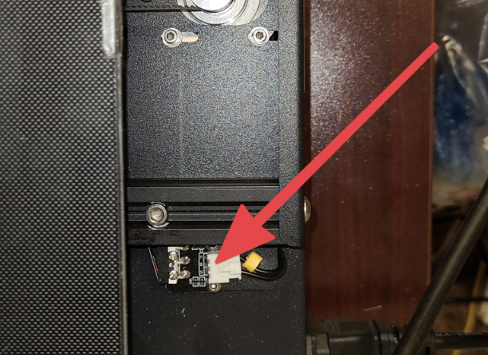

# Updating Firmware

## **Introduction** 

 This page is a guide on how to properly update your TL or LNL printer. This guide is compatible with all TL-D3, H2, D5, and D6 printers. All steps are necessary in-order to complete the process. Please read every section carefully as one missed step can lead to malfunction. Proceed at your own risk.
___

!!! Example "Resources"
    All firmware updates will require Xloader and the CH340 drivers. Please download from the links below.

    [XLoader :octicons-file-16:](https://store2.gofile.io/download/50ae0303-b071-42c0-8928-0a0d54bc0016/xloader-v1.00-20220128T004944Z-001.zip){ .md-button .md-button--primary }
    [CH340 Driver :material-hammer-screwdriver:](https://store4.gofile.io/download/66acd7dd-af42-4a75-a8ad-0387def96dc9/CH340.rar){ .md-button .md-button--primary }

!!! warning inline-end "Before Proceeding, Power Off Your Printer."
    The motherboard should be updated with 5V power provided by USB connection.
    
 You will need the following items:

- [x] Windows PC
- [x] CH340 drivers installed and Xloader
- [x] Included USB A to USB B Cable
- [x] Firmware suited for your specific unit

!!! notice ""
    If you already have your firmare, you can skip the next section.

___
## **Finding the Right Firmware**

!!! Notice "For BMG Extruders:"
    Firmware above 1.0.29 will autodetect all parameters so there is no need to find a specific file. Just ensure that it matches your printer (IE. D3, H2, D6)

!!! Notice "For Regular Extruders:"
    Firmware version will be between 1.0.0 and 1.0.26 <- being the latest. 

Firmware is seperated by four parameters:

* Powersupply
* LCD manufacturer (TJC OR DWN)
* Y Axis Switch Type (Mechanical or Optical)
* Stepper motor driver type (4988 or 2208/2209)

### Power Supply ###

!!! Warning "Troubleshooting"
    Choosing the wrong powersupply can either limit the temperatures that your machine can reach or cause power failure if you try to draw too much power.

=== "350W" 

    !!! info inline end
        * The bed cabling coming from the base of the printer will be attached by a metallic coupler.

    { align=left, width="400" }

 

=== "600W"

    !!! info inline end
        * The bed cabling coming from the base of the printer will just be a wire loom.

    { align=left, width="400" }

### LCD Type ###

!!! Warning "Troubleshooting"
    If your screen is displaying the "loading..." symbol and not progressing, you most likely have flashed the wrong LCD version.

=== "TJC" 

    !!! Info inline end

        * UI version will begin with 1.2
        * Back of the LCD will have a blue circuit boardhello 

    { align=left, width="400" }

 

=== "DWN"

    !!! info inline end
        * UI version will begin with 1.3
        * Back of the LCD will have a green circuit board  

    { align=left, width="400" }

### Y Axis Sensor Type ###

!!! Warning "Troubleshooting"
    If during homing, your bed moves forward instead of back, you must switch from the Mechanical firmware to Optical.

=== "Optical (-O)" 

    !!! info inline end
        * The switch will be an optical sensor with no moving parts

    { align=left, width="400" }

 

=== "Mechanical (-M)"

    !!! info inline end
        * The switch at the back of the bed will have a physical click

    { align=left, width="400" }

### Stepper Driver Type ###

!!! Warning "Troubleshooting"
    If all of your motors are moving in the opposite direction, you are using the wrong stepper driver type and must switch to the opposite.

=== "2209"

    !!! info inline end
        * Comes with a blue heatsink.

    { align=left, width="400" }

=== "4988"

    !!! info inline end
        * Usually comes with a silver heatsink. 

    { align=left, width="400"}

___

## **Uploading Firmware** ##

### Video Guide

!!! info "Video"
    This is a simple tutorial video to show you the basic process. There is also a written guide below. 

___

1. Ensure you have Xloader and the CH340 Driver installed.
2. Download the appropriate firmware from our <a href="https://www.lnl3d.com/FIRMWAREREQUEST">request page</a>.
3. Plug in the connection between your PC and the printer.
4.  Open the Xloader folder and run Xloader.exe.

    !!! info inline
        Your parameters should have all of the same values as the image shown. (The only things that will change is your hex file at the top and the COM-port). Click the dropdown menu to view your COM-ports.
    { align=right, width="300" }

5. Once all parameters are set, click upload...

___
    

## **FAQ** ##
    
!!! notice "Cannot Open Port"

    ** 1. This is typically caused by choosing the wrong COM-port or a faulty USB cable.**
    
        Verify your computer detects your printer:

        1. Press the Windows Key.
        2. Type Device Manager.
        3. Navigate to USB Serial Devices.
        4. Make sure the printer shows up, you can unplug and replug the connection to see any change in devices.

    ** 2. After downloading CH340 Drivers and installing, be sure to restart your PC.**

!!! failure "Upload Failed?"
    ** 1. Sometimes Xloader will say upload failed but actually succesfully upload. Verify by going to your printer menu, settings, then checking the firmware version. **

    ** 2. Another cause of this could be a bad USB connection, try to change the USB port you're using or trying another cable. **

